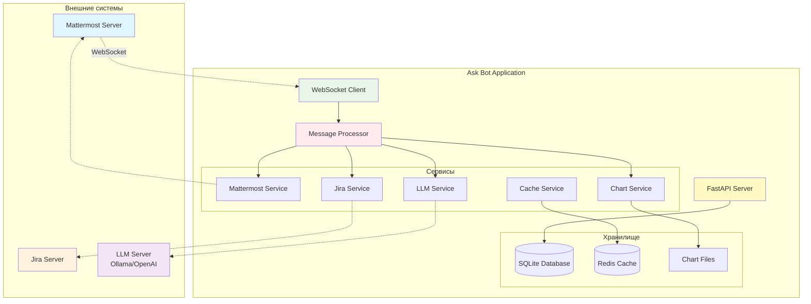
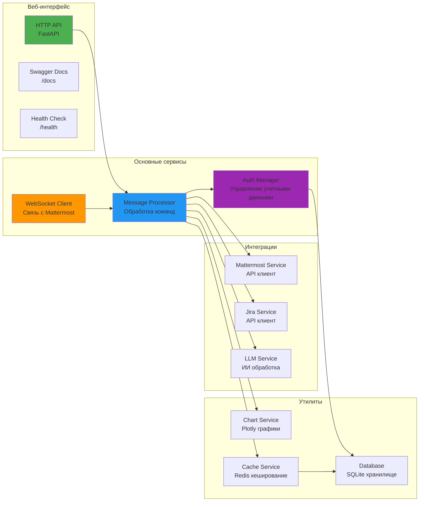
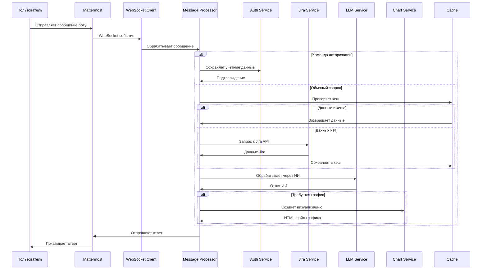
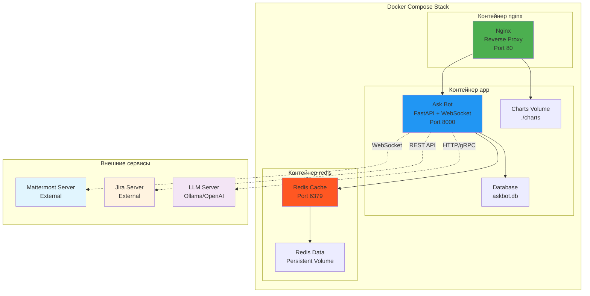
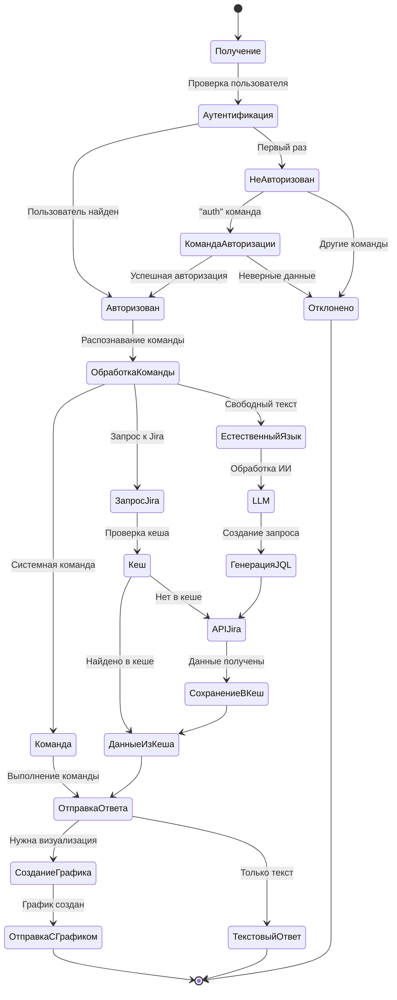
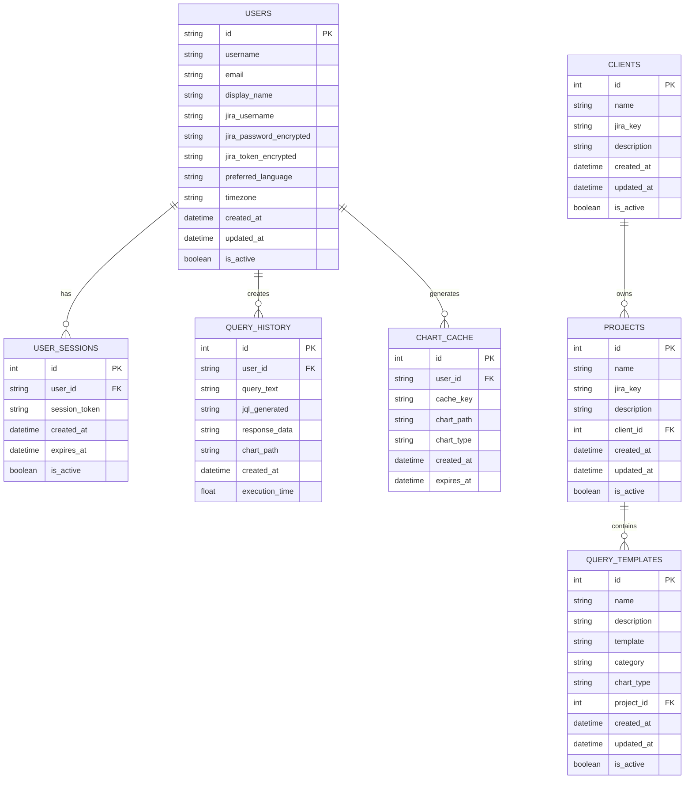

# 🤖 Ask Bot - Интеллектуальный помощник для Jira (БИТ.Цифра)

[](https://www.python.org/downloads/)
[](https://fastapi.tiangolo.com/)
[](https://www.docker.com/)
[](LICENSE)

**Ask Bot** — это современный чат-бот для работы с Jira через Mattermost, оснащенный искусственным интеллектом и возможностями визуализации данных. Бот работает через личные сообщения и предоставляет интуитивный интерфейс для управления задачами, анализа проектов и создания отчетов.

## 🎯 Ключевые возможности

- 🚀 **Интеграция с Jira**: Полный доступ к задачам, проектам и отчетам
- 🤖 **ИИ-помощник**: Обработка запросов на естественном языке через LLM
- 📊 **Визуализация**: Автоматическое создание графиков и диаграмм с Plotly
- 💬 **Личные сообщения**: Работа только через приватные чаты в Mattermost
- ⚡ **WebSocket**: Мгновенная обработка сообщений в реальном времени
- 🗄️ **Кеширование**: Быстрая работа с Redis для часто запрашиваемых данных
- 🔐 **Безопасность**: Шифрование паролей и токенов пользователей
- 🐳 **Docker**: Простое разворачивание с помощью контейнеров
- 📈 **Мониторинг**: Health checks и статистика работы системы

## 🏗️ Архитектура системы

Ask Bot построен на современной микросервисной архитектуре с использованием FastAPI и WebSocket для обеспечения высокой производительности и надежности.



### Основные компоненты

- **FastAPI Server** - HTTP API для управления и мониторинга
- **WebSocket Client** - Постоянное соединение с Mattermost
- **Message Processor** - Ядро обработки команд и запросов
- **Service Layer** - Модульные сервисы для интеграций
- **Cache Layer** - Redis для оптимизации производительности
- **Storage Layer** - SQLite для персистентных данных



### Потоки данных



**Основные этапы:**
1. **Входящие сообщения**: Mattermost → WebSocket → Message Processor
2. **Обработка команд**: Command Parser → Service Handlers → Response Generator
3. **Jira интеграция**: Auth Manager → Jira API → Data Transformation
4. **ИИ обработка**: LLM Service → Natural Language Processing → Smart Responses
5. **Визуализация**: Chart Service → Plotly → HTML Export → File Delivery

## 📋 Требования

- **Python 3.8+** (скрипты автоматически проверят версию)
- **Redis Server** (опционально, можно запустить через Docker)
- **Доступ к Jira** (API Token или пароль)
- **Доступ к Mattermost** (Bot Token)
- **LLM сервер** (Ollama, OpenAI-совместимый API)

## 🚀 Быстрый запуск

### Автоматическая установка (рекомендуется)

```bash
# Клонирование репозитория
git clone <repository-url>
cd Ask_bot

# Запуск одной командой
./scripts/run.sh
```

Скрипт автоматически:
- ✅ Проверит Python 3.8+
- ✅ Создаст виртуальное окружение
- ✅ Установит зависимости
- ✅ Создаст `.env` файл из шаблона
- ✅ Завершит старые процессы на порту 8000
- ✅ Запустит бот в режиме разработки

### Ручная установка

```bash
# Создание виртуального окружения
python -m venv venv
source venv/bin/activate  # Linux/Mac
# или
venv\Scripts\activate  # Windows

# Установка зависимостей
pip install -r requirements.txt

# Создание конфигурации
cp env.example .env
# Отредактируйте .env файл с вашими настройками

# Инициализация базы данных
python scripts/init_db.py

# Запуск приложения
python -m uvicorn app.main:app --host 0.0.0.0 --port 8000 --reload
```

### Docker разворачивание



```bash
# Настройка окружения
cp env.example .env
# Отредактируйте .env файл

# Запуск с Docker Compose
docker-compose up -d

# Проверка статуса
docker-compose ps
```

## ⚙️ Конфигурация

### Основные настройки (.env файл)

```bash
# Приложение
APP_MODE=development
APP_HOST=0.0.0.0
APP_PORT=8000
LOG_LEVEL=INFO

# Mattermost (обязательно)
MATTERMOST_URL=https://your-mattermost.com
MATTERMOST_TOKEN=your-bot-token
MATTERMOST_BOT_USERNAME=askbot
MATTERMOST_TEAM_ID=your-team-id

# Jira (обязательно)
JIRA_BASE_URL=https://your-jira.com

# LLM сервер
LLM_PROXY_URL=http://localhost:11434  # Ollama
LLM_MODEL_NAME=llama2
LLM_TEMPERATURE=0.3
LLM_MAX_TOKENS=2048

# База данных
DATABASE_URL=sqlite:///./askbot.db

# Redis кеш
REDIS_URL=redis://localhost:6379/0
CACHE_TTL=3600

# Графики
CHARTS_DIR=./charts
CHARTS_TTL=86400
```

### Настройка Mattermost

1. **Создайте Bot Account**:
   - Системная консоль → Интеграции → Bot Accounts
   - Создайте нового бота с именем `askbot`
   - Скопируйте токен доступа

2. **Настройте права**:
   - Разрешите ботам создавать прямые сообщения
   - Добавьте бота в нужную команду

### Настройка Ollama (для локального LLM)

```bash
# Установка Ollama
curl -fsSL https://ollama.com/install.sh | sh

# Загрузка модели
ollama pull llama2

# Запуск сервера
ollama serve
```

### После запуска доступно:

- 🌐 **API**: http://localhost:8000
- 📚 **Swagger документация**: http://localhost:8000/docs
- 💓 **Health Check**: http://localhost:8000/health
- 🔧 **WebSocket статус**: http://localhost:8000/websocket/status

## 💬 Использование

### Команды бота

После запуска найдите бота `askbot` в Mattermost и напишите ему личное сообщение:

#### Основные команды

- `помощь` / `help` - Показать справку по командам
- `статус` / `status` - Проверить статус авторизации и системы
- `авторизация [логин] [пароль]` / `auth [login] [password]` - Войти в Jira

#### Работа с проектами

- `проекты` / `projects` - Список доступных проектов Jira
- `задачи [проект]` - Показать задачи проекта
- `создать задачу` - Интерактивное создание новой задачи

#### Аналитика и отчеты

- `отчет по проекту [ключ проекта]` - Аналитический отчет с графиками
- `статистика спринта` - Статистика текущего спринта
- `график burndown` - График выполнения задач

#### Кеш и система

- `кеш статистика` / `cache stats` - Статистика использования кеша
- `очистить кеш` / `clear cache` - Очистить весь кеш
- `обновить` / `refresh` - Обновить словари и маппинги

### Естественные запросы

Бот понимает запросы на естественном языке:

```
"Покажи мне все открытые баги в проекте MYPROJ"
"Сколько задач закрыл Иван за последнюю неделю?"
"Создай график выполнения задач по приоритетам"
"Найди все задачи с меткой 'urgent'"
```

### Жизненный цикл обработки сообщения



## 🔧 API документация

### REST API эндпоинты

После запуска API доступно по адресу: `http://localhost:8000`

- **Swagger UI**: `http://localhost:8000/docs`
- **ReDoc**: `http://localhost:8000/redoc`

#### Основные эндпоинты

```http
GET /                    # Информация о сервисе
GET /health             # Проверка здоровья системы
GET /websocket/status   # Статус WebSocket подключения

GET /cache/stats        # Статистика кеша
POST /cache/clear       # Очистка кеша

POST /charts/cleanup    # Очистка старых графиков

GET /debug/test-llm     # Тест LLM подключения
GET /debug/test-jira    # Тест Jira подключения
```

### WebSocket интерфейс

Внутренний WebSocket используется для связи с Mattermost. Прямой доступ через веб-интерфейс не предоставляется.

## 📊 Мониторинг и логирование

### Health Check

```bash
# Проверка статуса системы
curl http://localhost:8000/health

# Ответ:
{
    "status": "healthy",
    "database": true,
    "redis": true,
    "mattermost": true,
    "jira": true,
    "llm": true,
    "websocket": true,
    "timestamp": "2024-01-15T12:00:00Z"
}
```

### Логирование

Логи сохраняются в директорию `logs/`:
- `askbot.log` - Основные логи приложения
- Ротация каждые 10MB
- Хранение 7 дней

### Мониторинг в Docker

```bash
# Логи контейнеров
docker-compose logs -f

# Статистика ресурсов
docker-compose top

# Состояние сервисов
docker-compose ps
```

## 🧪 Тестирование

### Запуск тестов

```bash
# Все тесты
./run_tests.sh

# Конкретный тест
python -m pytest tests/test_jira_service.py -v

# Интеграционные тесты
python -m pytest tests/integration/ -v
```

### Тестовые данные

```bash
# Загрузка тестовых данных в БД
python -c "
from examples.sample_data import load_sample_data
load_sample_data()
"
```

## 🔧 Разработка

### Структура проекта

```
Ask_bot/
├── app/                    # Основное приложение
│   ├── api/               # API роуты и webhook'и
│   ├── models/            # Модели данных и схемы
│   ├── services/          # Бизнес-логика и интеграции
│   ├── utils/             # Утилиты и хелперы
│   ├── config.py          # Конфигурация приложения
│   └── main.py            # Точка входа FastAPI
├── charts/                # Генерируемые графики
├── examples/              # Примеры и тестовые данные
├── logs/                  # Файлы логов
├── scripts/               # Скрипты для развертывания
├── docker-compose.yml     # Docker конфигурация
├── requirements.txt       # Python зависимости
└── .env                   # Переменные окружения
```

### Структура базы данных



### Добавление новых команд

1. **Определите команду** в `message_processor.py`:
```python
async def _handle_my_command(self, user_id: str, message: str) -> str:
    # Ваша логика
    return "Ответ пользователю"
```

2. **Зарегистрируйте команду**:
```python
self.commands['моякоманда'] = self._handle_my_command
```

### Добавление новых сервисов

1. Создайте файл в `app/services/`
2. Наследуйтесь от базового класса
3. Реализуйте контекстный менеджер
4. Добавьте в `main.py` для инициализации

## 🚨 Устранение неполадок

### Частые проблемы

**WebSocket не подключается**:
```bash
# Проверьте URL и токен в .env
# Убедитесь что бот добавлен в команду
curl -H "Authorization: Bearer $MATTERMOST_TOKEN" \
     $MATTERMOST_URL/api/v4/users/me
```

**LLM не отвечает**:
```bash
# Проверьте доступность Ollama
curl http://localhost:11434/api/version

# Убедитесь что модель загружена
ollama list
```

**Redis недоступен**:
```bash
# Проверьте статус Redis
redis-cli ping

# В Docker
docker-compose logs redis
```

### Отладка

```bash
# Запуск в режиме отладки
LOG_LEVEL=DEBUG python -m uvicorn app.main:app --reload

# Тест отдельных компонентов
python quick_test.py

# Проверка конфигурации
python scripts/check-config.py
```

## 📝 Changelog

### v1.0.0 (Текущая версия)
- ✅ WebSocket интеграция с Mattermost
- ✅ Обработка личных сообщений
- ✅ LLM интеграция (Ollama/OpenAI)
- ✅ Визуализация данных с Plotly
- ✅ Redis кеширование
- ✅ Docker контейнеризация
- ✅ Comprehensive API документация

### Планируемые улучшения
- 🔄 Поддержка групповых чатов
- 🔄 Webhook интеграция
- 🔄 Расширенная аналитика
- 🔄 Поддержка множественных LLM провайдеров
- 🔄 Интеграция с Confluence

## 🤝 Вклад в проект

Мы приветствуем вклад в развитие Ask Bot! 

1. Fork репозитория
2. Создайте feature branch (`git checkout -b feature/AmazingFeature`)
3. Commit изменения (`git commit -m 'Add some AmazingFeature'`)
4. Push в branch (`git push origin feature/AmazingFeature`)
5. Создайте Pull Request

## 📄 Лицензия

Этот проект распространяется под лицензией MIT. См. файл `LICENSE` для подробностей.

## 👥 Команда

- **Разработка** - Стас Чашин

## 🔗 Полезные ссылки

- [FastAPI Documentation](https://fastapi.tiangolo.com/)
- [Mattermost API](https://api.mattermost.com/)
- [Jira REST API](https://developer.atlassian.com/server/jira/platform/rest-apis/)
- [Ollama Documentation](https://ollama.com/docs)
- [Docker Compose](https://docs.docker.com/compose/)

---

<div align="center">

**BIT.Digital Ask Bot** - Делаем работу с Jira простой и интеллектуальной! 🚀

</div> 